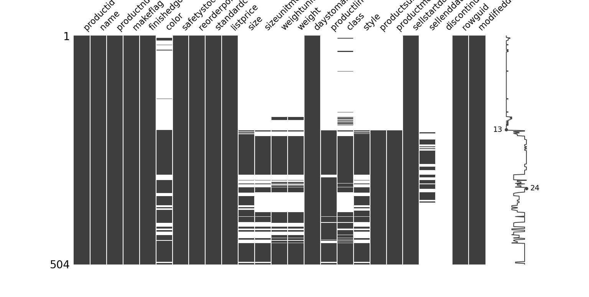

# Python Tips & Tricks

Some Tips and Tricks about Python.

[](http://forthebadge.com) [](http://forthebadge.com)  [](http://forthebadge.com)  [](http://forthebadge.com)  [](http://forthebadge.com)


## Useful documents

* [BeautifulSoup overview](./scripts/XmlParser.py) - An overview of BeautifulSoup library, in order to parse XML files.
* [VB inspection](./scripts/Oletools.py) - An overview Oletools library, in order to inspect VB code
* [ETL Job](./scripts/etl_job.py) - An overview of Pyspark library
* [Data Analysis with Sweetwiz](./scripts/sample.py) - an overview of Sweetviz library
* [Missingo](./scripts/missingno.py) - Helps you to find all the missing values and display them
* [Check Access/Modification/Creation time](./scripts/FileProperties.py) - get Acces/Modification/Creation time of files

## Useful links

* [BeautifulSoup](https://www.crummy.com/software/BeautifulSoup/bs4/doc/) - Python library for pulling data out of HTML and XML files
* [OleTools](http://www.decalage.info/python/oletools) - Tools developed in Python to analyze OLE files and Microsoft Office files
* [PySpark](https://pypi.org/project/pyspark/) - Apache Spark Python API
* [How to create a simple ETL job locallu with PySpark, Postgresql and Docker](https://itnext.io/how-to-create-a-simple-etl-job-locally-with-pyspark-postgresql-and-docker-ea53cd43311d?gi=a2a94c46582d)
* [Design Patterns](https://refactoring.guru/design-patterns/python) - The catalog of Python examples
* Play with [TQDM](https://tqdm.github.io/), a smart progress meter
* [Sweetviz](https://pypi.org/project/sweetviz/) - Open-source Pyhton library for EDA
* [Sweetviz Repo](https://github.com/fbdesignpro/sweetviz)

## Tomorrow I will learn

* [ETL in Python](https://towardsdatascience.com/how-to-write-etl-operations-in-python-baffbceeadf4)
* [Graphing example from SQLite](https://pythonprogramming.net/graphing-from-sqlite-database/) - Graphing in Python
* [Seaborn](http://seaborn.pydata.org/) - Statistical data vizualization
* [DataQuest](https://www.dataquest.io/blog/python-data-visualization-libraries/) - Comparing 7 tools for dataviz in Python
* [Scrapy](https://scrapy.org/) - An open source and collaborative framework for extracting the data you need from websites
* [Records](https://github.com/kennethreitz-archive/records) - A very simple library for making raw SQL queries to most relational databases
* [Django](https://www.djangoproject.com/) - Python Web framework
* Build Your First [Python Chatbot](https://dzone.com/articles/python-chatbot-project-build-your-first-python-pro) Project
* [Python Chatbot Project](https://data-flair.training/blogs/python-chatbot-project/)
* [SQLite](https://www.sqlitetutorial.net/sqlite-python/insert/) with Python (some stuffs [here](https://zestedesavoir.com/tutoriels/1294/des-bases-de-donnees-en-python-avec-sqlite3/) and [more](https://docs.python.org/2/library/sqlite3.html))
* [Unit Testing](https://docs.python.org/fr/3/library/unittest.html)
* [Python](https://openclassrooms.com/fr/courses/235344-apprenez-a-programmer-en-python/232721-apprehendez-les-classes)
* [Plotly](https://dash.plotly.com/) - An advanced Python analytics library
* [Geoplotlib](https://github.com/andrea-cuttone/geoplotlib) - Python toolbox for visualizing geographical data and making maps
* [Gleam](https://github.com/dgrtwo/gleam) - Convert your graphs into amazing web apps using just Python code
* [ggplot](https://github.com/tidyverse/ggplot2) - An advanced Python analytics library
* [Bokeh](https://docs.bokeh.org/en/latest/) - Generate a visualization that is friendly for web interfaces and browsers

## Build with

* [Python](https://www.python.org/) - Programming language
* [Docker](https://www.docker.com/) - Set of platform as a service (PaaS) products that use OS-level virtualization to deliver software in packages called containers
* [Git](https://git-scm.com) - Open source distributed version control system
* [PostgreSQL](https://www.postgresql.org) - Open source object-relational database system
* [Mockaroo](https://www.mockaroo.com/) - Random Data Generator and API Mocking Tool

## Get started with Oletools

This script aims to inspect the VB code present in the Excel files.

This allows you to quickly have an overview of the code present in these files and to hunt down "wild" extractions, CRUD operations via OLEDB or ODBC connections, ...

1. Install Python (if you haven't already)
2. Clone this repository
3. Install OleTools

```bat
pip install -U oletools
```

4. Configure the scan (directory & file pattern) through the oletools.ini file
5. Execute Oletools.py

```bat
Python Oletools.py
```

The script will expose in the /out/result.log folder the VBA contents of each scanned file.
Analysis logs are available in the /log/vba-inspect.log folder

## Get started with PySpark

1. Install Python (if you haven't already)
2. Clone this repository
3. Install PySpark

```bat
pip install pyspark
```

4. Install PyPandoc

```bat
pip install pypandoc
```
5. Execute etl_job.py

The script will load a CSV file (370 000 rows) into a PostgreSQL database.

## Get started with Sweetviz


Sweetviz is an open-source Python library that generates visualizations to kickstart EDA (Exploratory Data Analysis).
This project aims to test Sweetviz library in data quality audit.

1. Install sweetviz with pip

```bat
pip install sweetviz
```

2. Clone this project
3. Execute sample.py

### Screenshots


## Get started with Missingno

Sweetviz is an open-source Python library that generates visualizations to kickstart EDA (Exploratory Data Analysis).
This project aims to test Sweetviz library in data quality audit.

1. Install missingno with pip

```bat
pip install missingno
```

2. Clone this project
3. Execute missingno.py

### Screenshots



## Contributing

If you would like to contribute, read the CONTRIBUTING.md file to learn how to do so.
